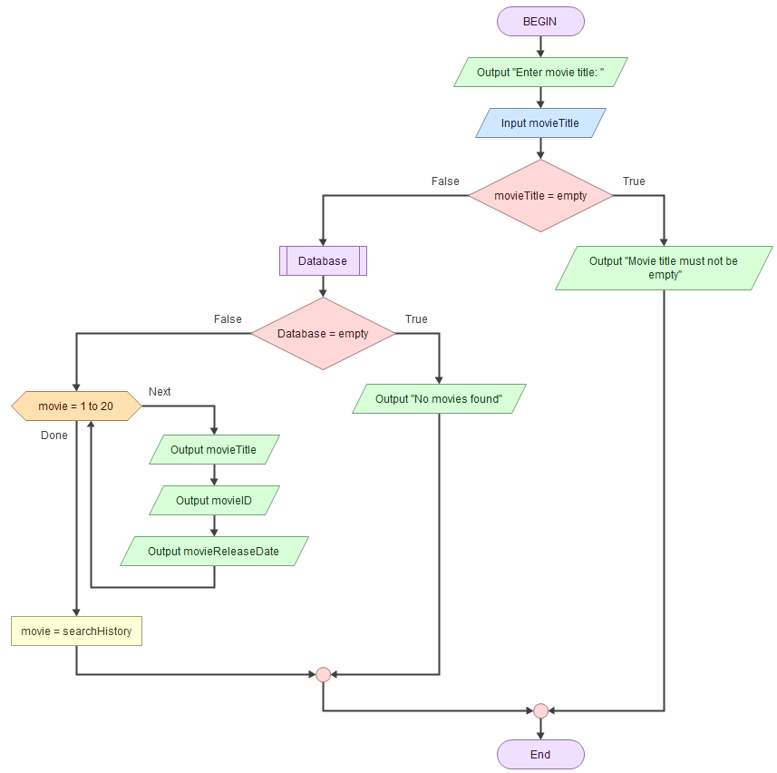
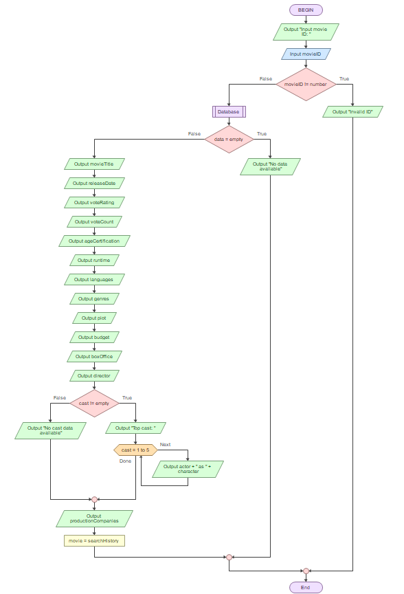
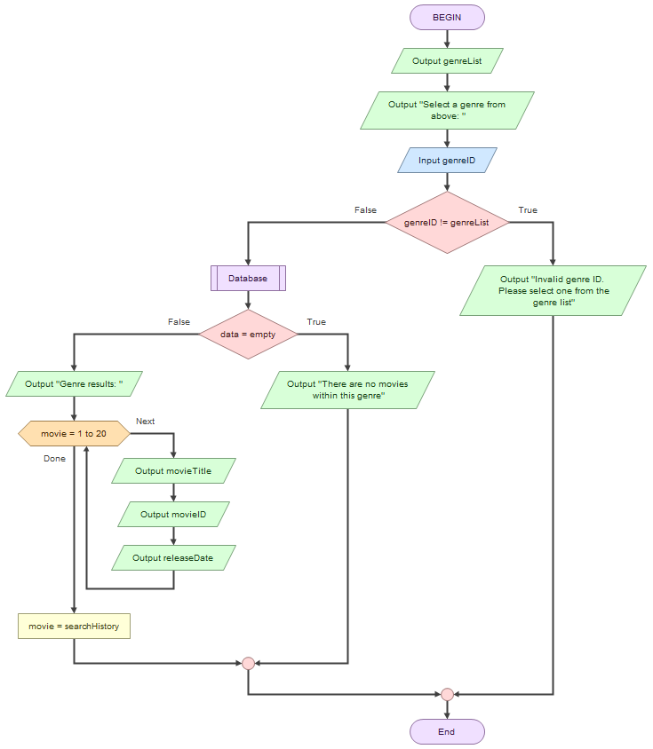
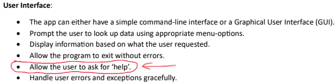

# **11ASE 2025 Task 1 - TMDb Movie Application**
## By **Levin Shao**
----------------------------------------------
## **Requirements Definition**
### **Functional Requirements**
* **Data Retrieval:** What does the user need to be able to view in the system? 

  The system must allow users to retrieve specific details about movies using the TMDb API. This includes the movies' titles, release dates, ratings, runtime durations, plot summaries, genres, age certifications, directors, cast lists, and more. Not only that, but users should also be able to search for movies by their title or TMDb ID. The system should also have options to let users filter movies by genre, view the most popular movies (on TMDb), and get recommendations based on specific films, etc etc.
* **User Interface:** What is required for the user to interact with the system?

  This program has very few things that are needed to be used. Any code terminal, such as the one in Visual Studio Code, would work in order for the program to successfully run and be used. Otherwise, use a text-based menu system that would present numbered options clearly. Also, users should obtain basic knowledge, such as reading and typing, prior to using the program. Lastly, if haven't already, users only need to install a few modules for the program to run. These modules are all listed in the requirements.txt file.
* **Data Display:** How should the presented data be displayed in the system?

  The system must present the search results in a consistent format, neatly showing movie IDs, titles, release dates etc in an organized fashion. This is to ensure that the user would be able to view the results easily and not get confused in the process. Also, all outputs should maintain proper formatting, even with long titles or missing data. Lastly, error messages are essential, and they need to be specific and logical, having the ability to guide users toward correct usage.
### **Non-Functional Requirements**
* **Performance:** How well does the system need to perform? 

  The application should perform efficiently and run smoothly on any device, including older and less stable systems. Performance should be maintained when using different platforms, so the user can user is confident that they can run it on their computer. The system should also be optimized so that the application won't cause any problems to the device (e.g. freezing, crashing) when ran. Lastly, the program must minimize resource usage (CPU/RAM) to avoid slowing down older devices.
* **Reliability:** How reliable does the system and data need to be?

  The data must be highly reliable to ensure users receive the most accurate and up-to-date information, and that they are not being misinformed, since misinformation is a huge issue and must not be present in this program. The system must also show its reliability by storing the user's data securely to prevent any security flaws from happening. It must be reliable enough to protect the user's data to the best of its ability.
* **Usability and Accessibility:** How easy to navigate does the system need to be? What instructions will we need for users to access the system?

  The user interface should be intuitive, accessible and very easy to navigate even for users with limited technical expertise, as we need to make sure that ANYONE can easily and effectively access and use the application without problems. Furthermore, the text interface should support keyboard-only navigation to support simplicity. Lastly, the program must include a built-in help command to explain the features.
## **Determining Specifications**
### **Functional Specifications**
* **User Requirements:** What does the user need to do?

    Users should be able to navigate around the program easily and efficiently, demonstrating capability to interact with the system, even if it is their first time of using the program. They should be able to use the in-built functions, such as searching for movies by title or genre, without ANY prior instructions.
* **Inputs & Outputs:** What inputs will the system need to accept and what outputs will it need to display?

  The system should accept text inputs (movie titles), numerical inputs (menu options 1-9, as well as movie and genre IDs), and the enter key to send the main input into the terminal. Other forms of input would likely to be redundant. Outputs would include lists of movies, detailed movie information (ID, title, release date, plot, runtime, etc), and error messages (e.g. "Invalid movie ID").
* **Core Features:** At its core, what specifically does the program need to be able to do?

  There are a few things the program need to be able to do, but the most important one is probably ensuring search functionality. For example, the system should accept partial movie titles (e.g. "Aveng" → "Avengers"), and validate ID inputs (e.g. rejects "ABC" as a movie ID). The data should also maintain adequate levels of accuracy, being able to fetch correct movie details from TMDb with no mistakes.
* **User Interaction:** How will users interact with the system (e.g. command-line, GUI?) and what information will it need to provide to help users navigate?

  Users will interact with the system via a text-based menu in the terminal, selecting options by number (e.g., "1. Search Movies"). Clear instructions, error messages, as well as the 8th option (Help Menu) will guide navigation.
* **Error Handling:** What possible errors could you face that need to be handled by the system?

  My system will handle the following possible errors:
  - Invalid inputs (e.g. text instead of numbers for IDs)
  - API failures (e.g. no internet, rate limits)
  - Missing data (e.g. movies without release date information)
### **Non Functional Specifications**
* **Performance:** How quickly should we try to get the system to perform tasks, what efficiency is required to maintain user engagement? How can we ensure our program remains efficient?

  To give users the best experience when using the program, performance is an essential aspect. To achieve high performance quality, the system should respond within 2–3 seconds for API calls, even when the API is at the peak time of worldwide usage. As mentioned before, the program should also run efficiently even on older devices. The code and caching are optimized to the best of my ability, and hopefully it will ensure smooth performance.
* **Usability & Accessibility:** How might you make your application more accessible? What could you do with the User Interface to improve usability?

  To make the program more both more usable and accessible, I could use a very simplistic text menu, as well as clear error messages that state both the issue and the solution (e.g., "Invalid input. Enter a number."). I've also made the application able to be navigated using just a keyboard, ensuring some degree of accessibility.
* **Reliability:** 
What could perhaps not crash the whole system, but could be an issue and needs to be addressed? Data integrity? Duplicate data? API retrieval crash?

  A huge issue that I've noticed which could occur in the program are incomplete data in the database. For example, minor movies on TDMb that nobody watches could be missing information such as a release date, an age classification (very common) or cast information. To fix this, I've made changes in the code so that when there are incomplete information detected, the program would output "No data available" to the user. However, these are mostly issues with the TMDb movie database itself and not really any of the program's fault.
## **Design**
### **Gantt Chart**


| Variable | Data Type | Format for Display | Size in Bytes | Size for Display | Description | Example | Validation |
|----------|-----------|--------------------|---------------|------------------|-------------|---------|------------|
| Movie ID | integer | number | 4 | 10 | TMDb movie identifier number | 550 | Must be a positive integer |
| Movie Title | string | text | 100 | 50 | Title of the movie | Fight Club | Max 100 characters |
| Release Date | string | YYYY-MM-DD | 10 | 10 | Release date of the movie | 1999-09-10 | Valid date format |
| Rating | float | N.NN/10 | 4 | 6 | The rating of the movie out of 10 | 8.44/10 | ≥0 |
| Vote Count | integer | number | 4 | 6 | Number of votes the movie have on TMDb | 30086 | Must be a positive integer |
| Age Classification | string | depends | 10 | 15 | Age rating of the movie | R | Must not include any symbols |
| Runtime | integer | number | 4 | 4 | Duration of the movie in minutes | 139 | Must be a positive integer and should be no more than 1000 |
| Languages | string | XXXXXXX | 14 | 50 | Spoken languages of the movie | English | Must not contain any numbers |
| Genres | string | XXXXXXX | 20 | 20 | Genres of the movie | Drama | Must not contain any numbers or symbols |
| Plot | string | text | 1000 | 200 | Plot summary of the movie | A ticking-time-bomb insomniac and a slippery soap salesman channel primal male aggression into a shocking new form of therapy... | No strict validations |
| Budget | integer | $N,NNN,NNN | 8 | 12 | Production cost of the movie in USD | $63,000,000 | Must contain a "$" symbol and be larger than 0 |
| Total Box Office | integer | $N,NNN,NNN | 8 | 12 | Worldwide box office of the movie in USD | $100,853,753 | Must contain a "$" symbol and be larger than 0 |
| Director | string | text | 50 | 30 | Primary director(s) of the movie | David Fincher | Must contain at least 2 words (first and last names) and not any numbers |
| Cast | array | text | varies | 200 | List of actors that starred in the movie | Edward Norton as Narrator | Can be an array of objects |
| Production Companies | array | text | varies | 100 | People/companies that played a key role in the production of the movie | Fox 2000 Pictures, Regency Enterprises... | No strict validations |
| Genre ID | integer | number | varies | 50 | Like the movie IDs, but for genres instead | 28 | Must be a positive integer |

### **Pseudocode**
```
BEGIN
  WHILE running
    DISPLAY menu_options
    INPUT user_choice
    
    IF user_choice EQUAL
      1: CALL search_movies
      2: CALL get_movie_details
      3: CALL get_popular_movies
      4: CALL get_upcoming_movies
      5: CALL search_by_genre
      6: CALL get_recommendations
      7: CALL view_search_history
      8: CALL help_guide
      9: SET running = FALSE
      DEFAULT: DISPLAY "Invalid choice"
    ENDIF
  ENDWHILE
END

BEGIN search_movies
  DISPLAY "Enter movie title: "
  INPUT movie_title
  IF movie_title IS EMPTY THEN
    DISPLAY "Title cannot be empty"
    RETURN
  ENDIF
  
  movie_data = API_REQUEST_MOVIE
  
  IF movie_data IS EMPTY THEN
    DISPLAY "No movies found"
  ELSE
    FOR TOP 20 movie IN movie_data
      DISPLAY movie.id, movie.title, movie.release_date
    ENDFOR
    ADD_TO_HISTORY
  ENDIF
END search_movies

BEGIN get_movie_details
  INPUT movie_id
  IF movie_id IS NOT NUMBER THEN
    DISPLAY "Invalid ID"
    RETURN
  ENDIF
  
  movie_data = API_REQUEST_MOVIE
  
  IF movie_data IS EMPTY THEN
    DISPLAY "Movie not found"
  ELSE
    DISPLAY movie.title
    DISPLAY movie.release_date OR "No date available"
    DISPLAY movie.rating OR "No data available"
    DISPLAY movie.vote_count OR "No votes yet"
    DISPLAY movie.age_classification OR "Not rated"
    DISPLAY movie.runtime OR "Not specified"
    DISPLAY movie.languages OR "No language data available"
    DISPLAY movie.genres OR "No genres"

    DISPLAY movie.plot OR "No description"

    DISPLAY movie.budget OR "No budget data"
    DISPLAY movie.box_office OR "No box office"

    DISPLAY movie.director OR "No director"
    
    IF movie.cast IS NOT EMPTY THEN
      FOR TOP 5 actor IN movie.cast
        DISPLAY actor.name + " as " + actor.character
      ENDFOR
    ELSE
      DISPLAY "No cast information"
    ENDIF
    
    DISPLAY movie.production_companies OR "No production companies"

    ADD_TO_HISTORY
  ENDIF
END get_movie_details

BEGIN get_popular_movies
  popular_data = API_REQUEST_MOST_POPULAR_MOVIE
  
  IF popular_data IS EMPTY THEN
    DISPLAY "No popular movies"
  ELSE
    FOR TOP 20 movie IN popular_data
      DISPLAY movie.id, movie.title, movie.release_date
    ENDFOR
    ADD_TO_HISTORY
  ENDIF
END get_popular_movies

BEGIN get_upcoming_movies
  upcoming_data = API_REQUEST_MOVIES_UPCOMING
  
  IF upcoming_data IS EMPTY THEN
    DISPLAY "No upcoming movies"
  ELSE
    FOR TOP 10 movie IN upcoming_data
      DISPLAY movie.id, movie.title, movie.release_date
    ENDFOR
    ADD_TO_HISTORY("Viewed upcoming movies")
  ENDIF
END get_upcoming_movies

BEGIN search_by_genre
  DISPLAY genre_list
  INPUT genre_id
  
  IF genre_id IS NOT VALID THEN
    DISPLAY "Invalid genre ID"
    RETURN
  ENDIF
  
  genre_data = API_REQUEST_MOVIE_IN_GENRE
  
  IF genre_data IS EMPTY THEN
    DISPLAY "No movies in this genre"
  ELSE
    FOR TOP 20 movie IN genre_data
      DISPLAY movie.id, movie.title, movie.release_date
    ENDFOR
    ADD_TO_HISTORY
  ENDIF
END search_by_genre

BEGIN get_recommendations
  INPUT movie_id
  IF movie_id IS NOT NUMBER THEN
    DISPLAY "Invalid ID"
    RETURN
  ENDIF
  
  rec_data = API_REQUEST_MOVIE_RECOMMENDATIONS
  
  IF rec_data IS EMPTY THEN
    DISPLAY "No recommendations found"
  ELSE
    FOR TOP 10 movie IN rec_data
      DISPLAY movie.id, movie.title, movie.release_date
    ENDFOR
    ADD_TO_HISTORY
  ENDIF
END get_recommendations

BEGIN view_search_history
  IF history IS EMPTY THEN
    DISPLAY "No history"
  ELSE
    FOR EACH entry IN history
      DISPLAY entry.query + " - Searched up on " + entry.timestamp
    ENDFOR
  ENDIF
END view_search_history

BEGIN help_guide
  DISPLAY HELP_GUIDE # There'll be too much text to display so I just simplified it to print HELP_GUIDE
  DISPLAY FAQ
  DISPLAY TIPS
END help_guide
```

### How The Pseudocode Works
First of all, the program initiates. Then the program displays the menu options (9 options in total, 8 excluding the last option which is to exit the program). The user chooses their desired option, then the program runs by beginning the part of the code/pseudocode that controls the function.

**search_movies** function: the user inputs the movie title, then the API sends a request to the database to fetch the results (which if I'm correct, should be based on the **("search/movie", query=movie_title)** command line, I may be wrong however). If the user inputs nothing, the program returns a statement regarding this issue, same with the one where there are no search results matching the user input. Otherwise, the program returns the top 20 results and shows their titles, IDs and release dates. Also add to search history (option 7).

**get_movie_details** function: the user inputs the ID of the movie, then the API sends a request to the database to fetch the exact details based on the movie with that ID. If the user doesn't input a valid number, the program returns a statement regarding this issue, same with the one where there are no movies matching the movie ID. Otherwise, the program returns the movie titles, release dates, ratings, runtimes, genres, overviews, movie castings (top 5 main cast only, otherwise return no cast information) and many, many more things. Also add to search history (option 7).

**get_popular_movies** function: pretty simple. If chosen as the user's desired option, sends a request to the database to fetch the most popular movies ranked. If there is an error occuring in the process, send "no data available", otherwise send the top 20 most popular movies and display their titles, IDs and release dates. Also add to search history (option 7).

**get_upcoming_movies** function: the program sends a request to the database to fetch the list of upcoming movies, however only the top 10 will be shown. If there are no upcoming movies/errors while fetching, the system sends an error message. Otherwise, list the top 10 movies and show their titles, IDs and release dates. Also add to search history (option 7).

**search_by_genre** function: the program first displays the list of genres available for the users to choose from (currently there are 10) and the user will input their genre's corresponding genre ID. If the ID is invalid, send an error message. Otherwise, send a request to the database to access the movies in that genre. If there are no movies in the genre (very rare and probably shouldn't happen at all, but this is a way to handle the error just in case) return a message regarding this issue. Otherwise, display the top 20 movies in the genre, showing their titles, IDs and release dates. Also add to search history (option 7).

**get_recommendations** function: user inputs the ID of a movie. If the ID is invalid, program sends an error message. Otherwise, send a request to the database to access the movies that are similar to the movie the user inputted (I assume this works by finding movies that are similar in **genre** with that movie but I'm not too sure). If the API fails to fetch recommendations, send an error message. Otherwise, choose the top 10 recommendations, and display their titles, IDs and release dates. Also add to search history (option 7).

**view_search_history** function: pretty simple. If chosen as the user's desired option, try accessing the search history log. If history is empty, display "No history". Otherwise, for each entry in the search history, display as "Entry Query", Searched up on "Specific Timestamp".

**help_guide** function: the most simple one out of all functions here. This function didn't even take me 30 minutes to create. It literally just displays a textual-based how-to guide on using the program. This function only uses the most basic "print" statement, and nothing else.

### **Flowcharts**
#### **Flowchart 1: search_movies function**

#### **Flowchart 2: get_movie_details function**
If this image is hard to view properly due to the sheer amount of outputs, you can just open the .fprg file in the src folder and view it inside Flowgorithm.

#### **Flowchart 3: search_by_genre function**
This is almost identical to the first flowchart since I based off the code for this function from the search_movies function, so yeah.


## **Development**
### Development Progress #1: some basic testing to see if the API actually works
```
import requests

API_KEY = "2b556e2cf294ec2f4a6b5fa4770f3732"

def api_test():
    url = f"https://api.themoviedb.org/3/movie/550?api_key={API_KEY}" # 550 is an example movie ID (It's the movie ID of "Fight Club" from 1999)
    response = requests.get(url)
    if response.status_code == 200:
        data = response.json()
        print(f"Success! Got data for: {data['title']}")
    else:
        print("Failed to connect to API :sadface:")

if __name__ == "__main__":
    api_test()
```
### Development Progress #2:
```
import requests

# Basic TMDb Config
API_KEY = "2b556e2cf294ec2f4a6b5fa4770f3732" # API key
BASE_URL = "https://api.themoviedb.org/3/" # Base URL

def search_movies():
    """Basic movie search functionality"""
    query = input("Enter movie title: ")
    response = requests.get(
        f"{BASE_URL}search/movie",
        params={"api_key": API_KEY, "query": query}
    )
    if response.status_code == 200:
        movies = response.json()["results"][:5]
        for movie in movies:
            print(f"{movie['title']} ({movie.get('release_date', 'No date')})")
    else:
        print("Error fetching data, please try again later")

if __name__ == "__main__":
    search_movies()
```
**Key Changes & Evaluation:**
- Removed all testing code and began to actually work on the program.
- At the end of the day, came up with a very basic movie search function. Lots of changes are to be made.
### Development Progress #3
```
import requests

# Basic TMDb Config
API_KEY = "2b556e2cf294ec2f4a6b5fa4770f3732" # API key
BASE_URL = "https://api.themoviedb.org/3/" # Base URL

def _fetch_tmdb_data(endpoint, params=None):
    # Fetch movie data from the API
    try:
        url = f"{BASE_URL}{endpoint}"
        params = params or {}
        params["api_key"] = API_KEY
        response = requests.get(url, params=params)
        response.raise_for_status()
        return response.json()
    except requests.exceptions.RequestException as e:
        print(f"Error fetching data: {e}")
        return None

def search_movies():
    """Search a movie by its title."""
    print("This is the movie search function.")
    print("If you entered something that would come up with way too many results, only the top 20 will show up.")
    query = input("Enter movie title: ").strip()
    if not query:
        print("Title should not be empty. Try again")
        return
    
    data = _fetch_tmdb_data("search/movie", {"query": query})
    if data and data.get("results"):
        print("\nSearch Results:")
        for idx, movie in enumerate(data["results"][:20], 1):
            # Handle empty strings, None, or missing keys
            release_date = movie.get('release_date')
            display_date = release_date if release_date else "No data available"
            print(f"{idx}. {movie['title']} (Release Date: {display_date})")
    else:
        print("No movies found!")

if __name__ == "__main__":
    search_movies()
```
**Key Changes & Evaluation:**
- Added a new function that fetches data for other functions. This made the process of retrieving data within functions much more convenient. This new function is a helper function that does work internally.
- Reworked some parts of the code, and made the movie search function a bit better and more inclusive on some parts
- Added instructions for the user (only to be deleted later as it got integrated into the help guide)
- Increased the limit to 20 instead of 5, since I remembered that long movie franchises like James Bond, Star Wars and Fast & Furious exists
- Added fallback for movies that have no data about their release dates
### Development Progress #4: **MAJOR UPDATE**
```
import requests
import time

# Basic TMDb Config
API_KEY = "2b556e2cf294ec2f4a6b5fa4770f3732" # API key
BASE_URL = "https://api.themoviedb.org/3/" # Base URL

def _fetch_tmdb_data(endpoint, params=None):
    # Fetch movie data from the API
    try:
        url = f"{BASE_URL}{endpoint}"
        params = params or {}
        params["api_key"] = API_KEY
        response = requests.get(url, params=params)
        response.raise_for_status()
        return response.json()
    except requests.exceptions.RequestException as e:
        print(f"Error fetching data: {e}")
        return None

def search_movies():
    """Search a movie by its title."""
    print("\nThis is the movie search function.")
    print("If you entered something that would come up with way too many results, only the top 20 will show up.")
    time.sleep(2)

    query = input("\nEnter movie title: ").strip()
    if not query:
        print("Title should not be empty. Try again")
        return
    
    data = _fetch_tmdb_data("search/movie", {"query": query})
    if data and data.get("results"):
        print("\nSearch Results (ID | Title | Release Date):")
        print("-" * 50)  # Divider line
        for idx, movie in enumerate(data["results"][:20], 1):
            # Get movie details
            movie_id = movie.get('id', 'N/A')
            title = movie.get('title', 'Untitled')
            
            # Handle release date
            release_date = movie.get('release_date')
            display_date = release_date if release_date else "No date available"
            
            # Format the output with consistent spacing
            print(f"{idx:2}. ID: {movie_id:<8} | {title:<30} | {display_date}")
    else:
        print("No movies found!")

def get_movie_details():
    """Get detailed info about a movie."""
    print("\nThis will use TMDb Movie IDs to ensure accuracy.")
    print("If you don't know the ID, use option 1 to search first.")
    time.sleep(1)
    
    movie_id = input("\nEnter TMDb Movie ID (e.g. 550 for 'Fight Club'): ").strip()
    if not movie_id.isdigit():
        print("Invalid ID! Must be a number.")
        return
    
    data = _fetch_tmdb_data(f"movie/{movie_id}", {"append_to_response": "credits"})
    
    # Validate that the data is usable
    if not data or data.get('status_code') == 34:  # 34 = Not Found
        print("Movie not found!")
        return
    
    # Title
    title = data.get('title', 'Untitled Movie')
    print(f"Title: {title}")
    
    # Release date
    release_date = data.get('release_date')
    print(f"Release Date: {release_date if release_date else 'No date available'}")
    
    # Rating
    vote_avg = data.get('vote_average')
    vote_count = data.get('vote_count', 0)
    if vote_avg and vote_count > 0:
        print(f"Rating: {vote_avg}/10 ({vote_count} votes)")
    else:
        print("Rating: Not rated yet")
    
    # Runtime
    runtime = data.get('runtime')
    if runtime and runtime > 0:
        print(f"Runtime: {runtime} mins ({runtime//60}h {runtime%60}m)")
    else:
        print("Runtime: Not specified")
    
    # Plot overview
    plot = data.get('overview')
    print(f"\nPlot: {plot if plot else 'No description available'}")
    
    # Cast
    print("\nTop Cast:")
    if data.get('credits', {}).get('cast'):
        for actor in data['credits']['cast'][:3]:  # Top 3 actors
            character = actor.get('character')
            print(f"- {actor['name']} as {character if character else 'Unknown role'}")
    else:
        print("- No cast information available")

def main():
    """The main user interface for the program"""
    print("\nWelcome! This is a movie database application made from the TMDb API")
    print("More options are coming soon")
    time.sleep(2)
    while True:
        print("\nCurrent Options:")
        print("1. Search Movies")
        print("2. Get Movie Details")
        print("3. Exit")

        time.sleep(2)
        choice = input("\nEnter your choice: ").strip()
        
        if choice == "1":
            search_movies()
        elif choice == "2":
            get_movie_details()
        elif choice == "3":
            print("Thanks for using this program!")
            print("Goodbye and see you next time!")
            break
        else:
            print("Invalid choice! Please enter a valid number between 1-3")

if __name__ == "__main__":
    main()
```
**Key Changes & Evaluation:**
- Made massive changes to the movie search function. You can now see the movie's TMDb ID when searched up, alongside their title and release date. This is done because the new Get Movie Details function requires you to input a movie's TMDb ID instead of its title, since if you make it search by title, multiple movies with the same name could cause conflict. To fix this, we will just make it search by ID, since each movie has a different ID and each ID is unique to a movie.
- Also, I found a way to neatly format the results into a clear table. I made it so that the new formatting is like a table with 3 columns, each column separated by a line. First column shows the ID, second shows the title, and third shows the release date. I did this because apparently you get more marks if the results are neat looking? Anyways, at least it looks much more satisfying to the eye and can tick off some non-functional requirements.
- Most importantly, **a brand new user interface.** How could one call their program a program without it having a user interface? This user interface currently only had these 3 options at the time of creation, but more are to be added later. This is a huge step-up in the program's functionality.
### Development Progress #5:
```
import requests
import time

# Basic TMDb Config
API_KEY = "2b556e2cf294ec2f4a6b5fa4770f3732" # API key
BASE_URL = "https://api.themoviedb.org/3/" # Base URL

def _fetch_tmdb_data(endpoint, params=None):
    # Fetch movie data from the API
    try:
        url = f"{BASE_URL}{endpoint}"
        params = params or {}
        params["api_key"] = API_KEY
        response = requests.get(url, params=params)
        response.raise_for_status()
        return response.json()
    except requests.exceptions.RequestException as e:
        print(f"Error fetching data: {e}")
        return None

def search_movies():
    """Search a movie by its title."""
    print("\nThis is the movie search function.")
    print("If you entered something that would come up with way too many results, only the top 20 will show up.")
    time.sleep(2)

    query = input("\nEnter movie title: ").strip()
    if not query:
        print("Title should not be empty. Try again")
        return
    
    data = _fetch_tmdb_data("search/movie", {"query": query})
    if data and data.get("results"):
        print("\nSearch Results (ID | Title | Release Date):")
        print("-" * 50)  # Divider line
        for idx, movie in enumerate(data["results"][:20], 1):
            # Get movie details
            movie_id = movie.get('id', 'N/A')
            title = movie.get('title', 'Untitled')
            
            # Handle release date
            release_date = movie.get('release_date')
            display_date = release_date if release_date else "No date available"
            
            # Format the output with consistent spacing
            print(f"{idx:2}. ID: {movie_id:<8} | {title:<30} | {display_date}")
    else:
        print("No movies found!")

def get_movie_details():
    """Get detailed info about a movie."""
    print("\nThis will use TMDb Movie IDs to ensure accuracy.")
    print("If you don't know the ID, use option 1 to search first.")
    time.sleep(1)
    
    movie_id = input("\nEnter TMDb Movie ID (e.g. 550 for 'Fight Club'): ").strip()
    if not movie_id.isdigit():
        print("Invalid ID! Must be a number.")
        return
    
    data = _fetch_tmdb_data(f"movie/{movie_id}", {"append_to_response": "credits"})
    
    # Validate that the data is usable
    if not data or data.get('status_code') == 34:  # 34 = Not Found
        print("Movie not found!")
        return
    
    # Title
    title = data.get('title', 'Untitled Movie')
    print(f"Title: {title}")
    
    # Release date
    release_date = data.get('release_date')
    print(f"Release Date: {release_date if release_date else 'No date available'}")
    
    # Rating
    vote_avg = data.get('vote_average')
    vote_count = data.get('vote_count', 0)
    if vote_avg and vote_count > 0:
        print(f"Rating: {vote_avg}/10 ({vote_count} votes)")
    else:
        print("Rating: Not rated yet")
    
    # Runtime
    runtime = data.get('runtime')
    if runtime and runtime > 0:
        print(f"Runtime: {runtime} mins ({runtime//60}h {runtime%60}m)")
    else:
        print("Runtime: Not specified")
    
    # Plot overview
    plot = data.get('overview')
    print(f"\nPlot: {plot if plot else 'No description available'}")
    
    # Cast
    print("\nTop Cast:")
    if data.get('credits', {}).get('cast'):
        for actor in data['credits']['cast'][:3]:  # Top 3 actors
            character = actor.get('character')
            print(f"- {actor['name']} as {character if character else 'Unknown role'}")
    else:
        print("- No cast information available")

def get_popular_movies():
        """Option 3: Display the current most popular movies on TMDb"""
        # Send an API request
        # https://api.themoviedb.org/3/movie/popular?api_key=2b556e2cf294ec2f4a6b5fa4770f3732
        data = __fetch_tmdb_data("movie/popular")

        if data and data.get("results"):
            print("\nPopular Movies ( ID | Title | Release Date):")
            print("-" * 60)  # Divider line
            for idx, movie in enumerate(data["results"][:20], 1): # Display only the top 20 results
                # Fetch movie ID, title and release date
                movie_id = movie.get('id', 'N/A')
                title = movie.get('title', 'Untitled')
                release_date = movie.get('release_date', 'No date available')
                
                # Format the result into a neat table with consistent spacing
                print(f"{idx:2}. ID: {movie_id:<8} | {title:<30} | {release_date}")
        else:
            print("No popular movies data available!")

def get_upcoming_movies():
        """Option 4: Fetch upcoming releases"""
        # Send an API request
        # https://api.themoviedb.org/3/movie/upcoming?api_key=2b556e2cf294ec2f4a6b5fa4770f3732
        data = _fetch_tmdb_data("movie/upcoming")

        if data and data.get("results"):
            print("\nUpcoming Movies:")
            print("-" * 60)  # Divider line
            for idx, movie in enumerate(data["results"][:10], 1):
                # For each movie in top 10 results, fetch and display their ID, title and release date
                movie_id = movie.get('id', 'N/A')
                title = movie.get('title', 'Untitled')
                release_date = movie.get('release_date', 'No date available')

                # Format neatly into a table
                print(f"{idx:2}. ID: {movie_id:<8} | {title:<30} | {release_date}")
        else:
            print("No upcoming movies data available!") # Print no data available if data retrieval fails

def main():
    """The main user interface for the program"""
    print("\nWelcome! This is a movie database application made from the TMDb API")
    print("More options are coming soon")
    time.sleep(2)
    while True:
        print("\nCurrent Options:")
        print("1. Search Movies")
        print("2. Get Movie Details")
        print("3. View Current Most Popular Movies)
        print("4. View Upcoming Releases)
        print("5. Exit")

        time.sleep(2)
        choice = input("\nEnter your choice: ").strip()
        
        if choice == "1":
            search_movies()
        elif choice == "2":
            get_movie_details()
        elif choice == "3":
            get_popular_movies()
        elif choice == "4":
            get_upcoming_movies()
        elif choice == "5":
            print("Thanks for using this program!")
            print("Goodbye and see you next time!")
            break
        else:
            print("Invalid choice! Please enter a valid number between 1-5")

if __name__ == "__main__":
    main()
```
**Key Changes & Evaluation:**
- Added 2 new functions. Users now have the ability to view the current most popular movies on TMDb, and also see any upcoming movies that are soon to come to theatres.
- This is also the part where I realised time is going faster than I expected so I began to spend more time on development to get more things done
### Development Progress #6:
```
import requests
import time

# Basic TMDb Config
API_KEY = "2b556e2cf294ec2f4a6b5fa4770f3732" # API key
BASE_URL = "https://api.themoviedb.org/3/" # Base URL

def _fetch_tmdb_data(endpoint, params=None):
    # Fetch movie data from the API
    try:
        url = f"{BASE_URL}{endpoint}"
        params = params or {}
        params["api_key"] = API_KEY
        response = requests.get(url, params=params)
        response.raise_for_status()
        return response.json()
    except requests.exceptions.RequestException as e:
        print(f"Error fetching data: {e}")
        return None

def search_movies():
    """Search a movie by its title."""
    print("\nThis is the movie search function.")
    print("If you entered something that would come up with way too many results, only the top 20 will show up.")
    time.sleep(2)

    query = input("\nEnter movie title: ").strip()
    if not query:
        print("Title should not be empty. Try again")
        return
    
    data = _fetch_tmdb_data("search/movie", {"query": query})
    if data and data.get("results"):
        print("\nSearch Results (ID | Title | Release Date):")
        print("-" * 50)  # Divider line
        for idx, movie in enumerate(data["results"][:20], 1):
            # Get movie details
            movie_id = movie.get('id', 'N/A')
            title = movie.get('title', 'Untitled')
            
            # Handle release date
            release_date = movie.get('release_date')
            display_date = release_date if release_date else "No date available"
            
            # Format the output with consistent spacing
            print(f"{idx:2}. ID: {movie_id:<8} | {title:<30} | {display_date}")
    else:
        print("No movies found!")

def get_movie_details():
    """Get detailed info about a movie."""
    print("\nThis will use TMDb Movie IDs to ensure accuracy.")
    print("If you don't know the ID, use option 1 to search first.")
    time.sleep(1)
    
    movie_id = input("\nEnter TMDb Movie ID (e.g. 550 for 'Fight Club'): ").strip()
    if not movie_id.isdigit():
        print("Invalid ID! Must be a number.")
        return
    
    data = _fetch_tmdb_data(f"movie/{movie_id}", {"append_to_response": "credits"})
    
    # Validate that the data is usable
    if not data or data.get('status_code') == 34:  # 34 = Not Found
        print("Movie not found!")
        return
    
    # Title
    title = data.get('title', 'Untitled Movie')
    print(f"Title: {title}")
    
    # Release date
    release_date = data.get('release_date')
    print(f"Release Date: {release_date if release_date else 'No date available'}")
    
    # Rating
    vote_avg = data.get('vote_average')
    vote_count = data.get('vote_count', 0)
    if vote_avg and vote_count > 0:
        print(f"Rating: {vote_avg}/10 ({vote_count} votes)")
    else:
        print("Rating: Not rated yet")
    
    # Runtime
    runtime = data.get('runtime')
    if runtime and runtime > 0:
        print(f"Runtime: {runtime} mins ({runtime//60}h {runtime%60}m)")
    else:
        print("Runtime: Not specified")
    
    # Plot overview
    plot = data.get('overview')
    print(f"\nPlot: {plot if plot else 'No description available'}")
    
    # Cast
    print("\nTop Cast:")
    if data.get('credits', {}).get('cast'):
        for actor in data['credits']['cast'][:3]:  # Top 3 actors
            character = actor.get('character')
            print(f"- {actor['name']} as {character if character else 'Unknown role'}")
    else:
        print("- No cast information available")

def get_popular_movies():
        """Option 3: Display the current most popular movies on TMDb"""
        # Send an API request
        # https://api.themoviedb.org/3/movie/popular?api_key=2b556e2cf294ec2f4a6b5fa4770f3732
        data = __fetch_tmdb_data("movie/popular")

        if data and data.get("results"):
            print("\nPopular Movies ( ID | Title | Release Date):")
            print("-" * 60)  # Divider line
            for idx, movie in enumerate(data["results"][:20], 1): # Display only the top 20 results
                # Fetch movie ID, title and release date
                movie_id = movie.get('id', 'N/A')
                title = movie.get('title', 'Untitled')
                release_date = movie.get('release_date', 'No date available')
                
                # Format the result into a neat table with consistent spacing
                print(f"{idx:2}. ID: {movie_id:<8} | {title:<30} | {release_date}")
        else:
            print("No popular movies data available!")

def get_upcoming_movies():
        """Option 4: Fetch upcoming releases"""
        # Send an API request
        # https://api.themoviedb.org/3/movie/upcoming?api_key=2b556e2cf294ec2f4a6b5fa4770f3732
        data = _fetch_tmdb_data("movie/upcoming")

        if data and data.get("results"):
            print("\nUpcoming Movies:")
            print("-" * 60)  # Divider line
            for idx, movie in enumerate(data["results"][:10], 1):
                # For each movie in top 10 results, fetch and display their ID, title and release date
                movie_id = movie.get('id', 'N/A')
                title = movie.get('title', 'Untitled')
                release_date = movie.get('release_date', 'No date available')

                # Format neatly into a table
                print(f"{idx:2}. ID: {movie_id:<8} | {title:<30} | {release_date}")
        else:
            print("No upcoming movies data available!") # Print no data available if data retrieval fails

def search_by_genre():
    """Filter movies by genre and display with IDs."""
    genres = {
        28: "Action",
        12: "Adventure",
        35: "Comedy",
        18: "Drama",
        27: "Horror",
        10749: "Romance",
        878: "Science Fiction",
        53: "Thriller",
        16: "Animation",
        80: "Crime"
    } # List of genres available
    
    print("\nAvailable Genres:")
    for id, name in sorted(genres.items()):
        print(f"{id}: {name}")
    
    genre_id = input("\nEnter genre ID: ").strip()
    if not genre_id.isdigit() or int(genre_id) not in genres:
        print("Invalid genre ID! Please enter a valid number from the list.")
        return
    
    # Fetch data from TMDb
    data = fetch_tmdb_data("discover/movie", {
        "with_genres": genre_id,
        "sort_by": "popularity.desc"  # Show most popular first
    })
    
    if data and data.get("results"):
        print(f"\n{genres[int(genre_id)]} Movies (ID | Title | Release Date):")
        print("-" * 60)
        for idx, movie in enumerate(data["results"][:20], 1):
            movie_id = movie.get('id', 'N/A')
            title = movie.get('title', 'Untitled')
            release_date = movie.get('release_date', 'No date available')
            print(f"{idx:2}. ID: {movie_id:<8} | {title:<30} | {release_date}")
    else:
        print("No movies found in this genre!")

def get_recommendations():
        """Option 6: Get recommendations based on a specific movie (i.e. fetch similar movies)"""
        movie_id = input("Enter TMDb Movie ID (e.g. 550 for 'Fight Club'): ").strip()

        # Check if movie ID is valid
        if not movie_id.isdigit():
            print("Invalid ID! Please input a valid numeric ID (e.g. 550 for 'Fight Club')")
            return
        
        # Fetch recommendations that are similar to the movie
        # https://api.themoviedb.org/3/movie/[MOVIE ID]/recommendations?api_key=2b556e2cf294ec2f4a6b5fa4770f3732
        data = _fetch_tmdb_data(f"movie/{movie_id}/recommendations")

        if data and data.get("results"):
            print(f"\nRecommendations for Movie ID {movie_id}:")
            print("-" * 60)  # Divider line
            for idx, movie in enumerate(data["results"][:10], 1):
                # For each movie in top 10 results, fetch and display their ID, title and release date
                movie_id = movie.get('id', 'N/A')
                title = movie.get('title', 'Untitled')
                release_date = movie.get('release_date', 'No date available')

                # Neatly format into a table
                print(f"{idx:2}. ID: {movie_id:<8} | {title:<30} | {release_date}")
        else:
            print("No recommendations found!") # When no data is available

def main():
    """The main user interface for the program"""
    print("\nWelcome! This is a movie database application made from the TMDb API")
    print("More options are coming soon")
    time.sleep(2)
    while True:
        print("\nCurrent Options:")
        print("1. Search Movies")
        print("2. Get Movie Details")
        print("3. View Current Most Popular Movies")
        print("4. View Upcoming Releases")
        print("5. Search by Genre")
        print("6. Get Recommendations")
        print("7. Exit")

        time.sleep(2)
        choice = input("\nEnter your choice: ").strip()
        
        if choice == "1":
            search_movies()
        elif choice == "2":
            get_movie_details()
        elif choice == "3":
            get_popular_movies()
        elif choice == "4":
            get_upcoming_movies()
        elif choice == "5":
            search_by_genre()
        elif choice == "6":
            get_recommendations()
        elif choice == "7":
            print("Thanks for using this program!")
            print("Goodbye and see you next time!")
            break
        else:
            print("Invalid choice! Please enter a valid number between 1-7")

if __name__ == "__main__":
    main()
```
**Key Changes & Evaluation:**
- Added 2 new functions. The first one is a search filter that lets you search for movies in a particular genre. The second one is a function that sends you recommendations based on a movie of your choice. The API does this by finding other movies that are similar to your one, whether it's due to the same genre or style.
### Development Progress #7: **MAJOR UPDATE**
```
import requests
import time

# Basic TMDb Config
API_KEY = "2b556e2cf294ec2f4a6b5fa4770f3732" # API key
BASE_URL = "https://api.themoviedb.org/3/" # Base URL

# Storage to log search history
search_history = []

def _fetch_tmdb_data(endpoint, params=None):
    # Fetch movie data from the API
    try:
        url = f"{BASE_URL}{endpoint}"
        params = params or {}
        params["api_key"] = API_KEY
        response = requests.get(url, params=params)
        response.raise_for_status()
        return response.json()
    except requests.exceptions.RequestException as e:
        print(f"Error fetching data: {e}")
        return None

def search_movies():
    """Search a movie by its title."""
    print("\nThis is the movie search function.")
    print("If you entered something that would come up with way too many results, only the top 20 will show up.")
    time.sleep(2)

    query = input("\nEnter movie title: ").strip()
    if not query:
        print("Title should not be empty. Try again")
        return
    
    data = _fetch_tmdb_data("search/movie", {"query": query})
    if data and data.get("results"):
        print("\nSearch Results (ID | Title | Release Date):")
        print("-" * 50)  # Divider line
        for idx, movie in enumerate(data["results"][:20], 1):
            # Get movie details
            movie_id = movie.get('id', 'N/A')
            title = movie.get('title', 'Untitled')
            
            # Handle release date
            release_date = movie.get('release_date')
            display_date = release_date if release_date else "No date available"
            
            # Format the output with consistent spacing
            print(f"{idx:2}. ID: {movie_id:<8} | {title:<30} | {display_date}")
        
        search_history.append((f"Search: {query}", datetime.now()))
    else:
        print("No movies found!")

def get_movie_details():
        """Option 2: Get specific details from a movie"""
        print("\nThis will use TMDb Movie IDs to ensure accuracy.")
        print("If you don't know the ID, use option 1 to search first.")
        
        movie_id = input("\nEnter TMDb Movie ID (e.g. 550 for 'Fight Club'): ").strip()
        
        if not movie_id.isdigit():
            # Check if movie ID is valid
            print("Invalid ID! Must be a number.")
            return

        # Send an API request to database
        # https://api.themoviedb.org/3/movie/[MOVIE ID]?api_key=2b556e2cf294ec2f4a6b5fa4770f3732&append_to_response=credits,release_dates
        data = _fetch_tmdb_data(f"movie/{movie_id}", {"append_to_response": "credits,release_dates"})

        # If there are no results, display "Movie not found!"
        if not data:
            print("Movie not found!")
            return

        # Title and release date
        print(f"\nTitle: {data.get('title', 'No data available')}")
        print(f"Release Date: {data.get('release_date', 'No data available')}")

        # Rating and vote count
        rating = data.get('vote_average')
        vote_count = data.get('vote_count', 0)
        if rating and vote_count > 0:
            print(f"Rating: {rating:.2f}/10 ({vote_count} votes)") # Format rating to 2 decimal places
        else:
            print("Rating: Not rated yet")

        # Age certification
        certifications = data.get('release_dates', {}).get('results', [])
        us_cert = 'No data available'

        for cert in certifications:
            if cert.get('iso_3166_1') == 'US':
                release_dates = cert.get('release_dates', [{}])
                us_cert = release_dates[0].get('certification', 'No data available')
                break

        print(f"Age Classification: {us_cert}")

        # Runtime
        runtime = data.get('runtime', 0)
        print(f"Runtime: {runtime} mins" if runtime > 0 else "Runtime: No data available")

        # Languages
        spoken_languages = [lang['english_name'] for lang in data.get('spoken_languages', [])]
        print(f"Languages: {', '.join(spoken_languages) if spoken_languages else 'No data available'}")

        # Genres
        genres = [g['name'] for g in data.get('genres', [])]
        print(f"Genres: {', '.join(genres) if genres else 'No data available'}")

        # Plot overview
        print(f"\nPlot: {data.get('overview', 'No description available')}")

        # Budget and box office info
        print(f"\nBudget (USD): ${data.get('budget', 0):,}" 
            if data.get('budget', 0) > 0 else "Budget: No data available")
        print(f"Total Box Office (USD): ${data.get('revenue', 0):,}" 
            if data.get('revenue', 0) > 0 else "Box Office: No data available")

        # Director/s
        directors = [
            p['name'] for p in data.get('credits', {}).get('crew', []) 
            if p['job'] == 'Director'
        ]
        print(f"\nDirector(s): {', '.join(directors) if directors else 'No data available'}")

        # Top 5 actors
        print("\nTop Cast:")
        cast = data.get('credits', {}).get('cast', [])
        if cast:
            for actor in cast[:5]:
                name = actor.get('name', 'Unknown actor')
                character = actor.get('character', 'Unknown role')
                print(f"- {name} as {character}")
        else:
            print("- No cast data available")

        # Production companies
        companies = [c['name'] for c in data.get('production_companies', [])]
        print(f"\nProduction Companies: {', '.join(companies) if companies else 'No data available'}")

        # Add to search history
        search_history.append((f"Details: {data['title']}", datetime.now()))

def get_popular_movies():
        """Option 3: Display the current most popular movies on TMDb"""
        # Send an API request
        # https://api.themoviedb.org/3/movie/popular?api_key=2b556e2cf294ec2f4a6b5fa4770f3732
        data = __fetch_tmdb_data("movie/popular")

        if data and data.get("results"):
            print("\nPopular Movies ( ID | Title | Release Date):")
            print("-" * 60)  # Divider line
            for idx, movie in enumerate(data["results"][:20], 1): # Display only the top 20 results
                # Fetch movie ID, title and release date
                movie_id = movie.get('id', 'N/A')
                title = movie.get('title', 'Untitled')
                release_date = movie.get('release_date', 'No date available')
                
                # Format the result into a neat table with consistent spacing
                print(f"{idx:2}. ID: {movie_id:<8} | {title:<30} | {release_date}")
            search_history.append(("Popular Movies", datetime.now()))
        else:
            print("No popular movies data available!")

def get_upcoming_movies():
        """Option 4: Fetch upcoming releases"""
        # Send an API request
        # https://api.themoviedb.org/3/movie/upcoming?api_key=2b556e2cf294ec2f4a6b5fa4770f3732
        data = _fetch_tmdb_data("movie/upcoming")

        if data and data.get("results"):
            print("\nUpcoming Movies:")
            print("-" * 60)  # Divider line
            for idx, movie in enumerate(data["results"][:10], 1):
                # For each movie in top 10 results, fetch and display their ID, title and release date
                movie_id = movie.get('id', 'N/A')
                title = movie.get('title', 'Untitled')
                release_date = movie.get('release_date', 'No date available')

                # Format neatly into a table
                print(f"{idx:2}. ID: {movie_id:<8} | {title:<30} | {release_date}")

            search_history.append(("Upcoming Movies", datetime.now()))
        else:
            print("No upcoming movies data available!") # Print no data available if data retrieval fails

def search_by_genre():
    """Filter movies by genre and display with IDs."""
    genres = {
        28: "Action",
        12: "Adventure",
        35: "Comedy",
        18: "Drama",
        27: "Horror",
        10749: "Romance",
        878: "Science Fiction",
        53: "Thriller",
        16: "Animation",
        80: "Crime"
    } # List of genres available
    
    print("\nAvailable Genres:")
    for id, name in sorted(genres.items()):
        print(f"{id}: {name}")
    
    genre_id = input("\nEnter genre ID: ").strip()
    if not genre_id.isdigit() or int(genre_id) not in genres:
        print("Invalid genre ID! Please enter a valid number from the list.")
        return
    
    # Fetch data from TMDb
    data = fetch_tmdb_data("discover/movie", {
        "with_genres": genre_id,
        "sort_by": "popularity.desc"  # Show most popular first
    })
    
    if data and data.get("results"):
        print(f"\n{genres[int(genre_id)]} Movies (ID | Title | Release Date):")
        print("-" * 60)
        for idx, movie in enumerate(data["results"][:20], 1):
            movie_id = movie.get('id', 'N/A')
            title = movie.get('title', 'Untitled')
            release_date = movie.get('release_date', 'No date available')
            print(f"{idx:2}. ID: {movie_id:<8} | {title:<30} | {release_date}")
        
        search_history.append((f"Genre: {genres[int(genre_id)]}", datetime.now()))
    else:
        print("No movies found in this genre!")

def get_recommendations():
        """Option 6: Get recommendations based on a specific movie (i.e. fetch similar movies)"""
        movie_id = input("Enter TMDb Movie ID (e.g. 550 for 'Fight Club'): ").strip()

        # Check if movie ID is valid
        if not movie_id.isdigit():
            print("Invalid ID! Please input a valid numeric ID (e.g. 550 for 'Fight Club')")
            return
        
        # Fetch recommendations that are similar to the movie
        # https://api.themoviedb.org/3/movie/[MOVIE ID]/recommendations?api_key=2b556e2cf294ec2f4a6b5fa4770f3732
        data = _fetch_tmdb_data(f"movie/{movie_id}/recommendations")

        if data and data.get("results"):
            print(f"\nRecommendations for Movie ID {movie_id}:")
            print("-" * 60)  # Divider line
            for idx, movie in enumerate(data["results"][:10], 1):
                # For each movie in top 10 results, fetch and display their ID, title and release date
                movie_id = movie.get('id', 'N/A')
                title = movie.get('title', 'Untitled')
                release_date = movie.get('release_date', 'No date available')

                # Neatly format into a table
                print(f"{idx:2}. ID: {movie_id:<8} | {title:<30} | {release_date}")

            search_history.append((f"Recommendations for Movie ID: {movie_id}", datetime.now()))
        else:
            print("No recommendations found!") # When no data is available

def view_search_history():
        """Option 7: Display past searches"""
        # Display "No search history yet" if there isn't anything in history
        if not search_history:
            print("No search history yet.")
            return
        
        print("\nSearch History:")
        # Loop through each entry in the search history storage, and provide details for each
        for idx, (query, time) in enumerate(search_history, 1):
            print(f"{idx}. {query} - Searched up on {time.strftime('%Y-%m-%d %H:%M:%S')}")

def main():
    """The main user interface for the program"""
    print("\nWelcome! This is a movie database application made from the TMDb API")
    print("More options are coming soon")
    time.sleep(2)
    while True:
        print("\nCurrent Options:")
        print("1. Search Movies")
        print("2. Get Movie Details")
        print("3. View Current Most Popular Movies")
        print("4. View Upcoming Releases")
        print("5. Search by Genre")
        print("6. Get Recommendations")
        print("7: View Search History")
        print("8. Exit")

        time.sleep(2)
        choice = input("\nEnter your choice: ").strip()
        
        if choice == "1":
            search_movies()
        elif choice == "2":
            get_movie_details()
        elif choice == "3":
            get_popular_movies()
        elif choice == "4":
            get_upcoming_movies()
        elif choice == "5":
            search_by_genre()
        elif choice == "6":
            get_recommendations()
        elif choice == "7":
            view_search_history()
        elif choice == "8":
            print("Thanks for using this program!")
            print("Goodbye and see you next time!")
            break
        else:
            print("Invalid choice! Please enter a valid number between 1-8")

if __name__ == "__main__":
    main()
```
**Key Changes & Evaluation:**
* Introducing... the search history! The search history is a new revolutionary function that allows you to access everything you have done with the program when you're using it. In case you've forgotten about the details of a specific movie, forgot about its ID as well, and isn't bothered to look it up again, no worries! Just go to the search history to access all your memories.
* Massively improved the get_movie_details function to include way more things about a movie. That means now you can also see its age classification, genres, languages, budget, box office, director, and production companies! Also, increased the top cast limit from 3 to 5, meaning that previously the program would only display 3 actors playing for the most central characters of the movie. Now it's gone up to 5. Hooray!
* This is the part when I thought I was done with the code, only to realise I have way more work to do after seeing integration.
## **Integration**
### Development Progress #8: **MAJOR UPDATE**
From this point onwards, I have separated my code (previously all written in a basic main.py file) into 2 files, a new and much more simple main.py file, which now just contains the code for the user interface; and methods.py, containing ALL the functions for the code. methods.py was imported to main.py so that the program works. I did this to satisfy the integration requirements.

**main.py**
```
import time # just purely for aesthetics, nothing else
from functions import TMDbMovieProgram # Import the program from methods.py (integration)

def main():
    """The main user interface for the program"""
    app = TMDbMovieProgram(api_key="2b556e2cf294ec2f4a6b5fa4770f3732") # API key
    
    # introduction
    print("\nWelcome! This is a movie database application made from the TMDb API")
    time.sleep(2)
    
    # option selections
    while True:
        print("\nOptions:")
        print("1. Search Movies")
        print("2. Get Movie Details")
        print("3. View Current Most Popular Movies")
        print("4. View Upcoming Releases")
        print("5. Search by Genre")
        print("6. Get Recommendations")
        print("7. View Search History")
        print("8. Exit")

        choice = input("\nEnter your choice: ").strip() # .strip will remove any leading and trailing whitespaces
        
        if choice == "1":
            app.search_movies()
        elif choice == "2":
            app.get_movie_details()
        elif choice == "3":
            app.get_popular_movies()
        elif choice == "4":
            app.get_upcoming_movies()
        elif choice == "5":
            app.search_by_genre()
        elif choice == "6":
            app.get_recommendations()
        elif choice == "7":
            app.view_search_history()
        elif choice == "8":
            print("Thanks for using this program!")
            print("Goodbye and see you next time!")
            break
        else:
            print("Invalid choice! Please enter a valid number between 1-8")

if __name__ == "__main__":
    main()
```
**methods.py**
```
import requests # essential if you want to work with APIs
from datetime import datetime # for search history time-logging

class TMDbMovieProgram: # will import this whole thing to main.py
    def __init__(self, api_key):
        self.API_KEY = api_key # Storage to store the API key for all future requests
        self.BASE_URL = "https://api.themoviedb.org/3/" # Base endpoint for all API calls to TMDb database
        self.search_history = [] # Storage to store search queries for the search history option
        self.genres = {
            28: "Action", 12: "Adventure", 35: "Comedy",
            18: "Drama", 27: "Horror", 10749: "Romance",
            878: "Science Fiction", 53: "Thriller",
            16: "Animation", 80: "Crime"
        } # The list of genres and their corresponding genre IDs. Currently there are only these 10 but more are coming soon

    def _fetch_tmdb_data(self, endpoint, params=None): # A helper function that fetches data for all the other functions
        """Function that attempts to fetch the data from the TMDb database"""
        # I added an underscore before "fetch" to symbolize that this is an internal function instead of an external one
        # Basically doing internal work (fetching data for external functions)
        # External functions are all the other functions that are exposed to the user for selection
        # This is just a python convention that's not necessary, but I used it anyways to make it look neat
        try:
            params = params or {} # Initialize the params
            params["api_key"] = self.API_KEY
            response = requests.get(f"{self.BASE_URL}{endpoint}", params=params) # Construct the full URL and make GET request
            response.raise_for_status() # Raise exception for any HTTP errors
            return response.json() # Parse and return JSON response
        except requests.exceptions.RequestException as e:
            # Handle any request-related errors (connection, timeout, etc.)
            print(f"Error fetching data: {e}")
            return None

    def search_movies(self):
        """Option 1: Search a movie by its title and display results with IDs"""
        query = input("\nEnter movie title: ").strip()

        # Validate input isn't empty
        if not query:
            print("Title should not be empty. Please try again")
            return
        
        # Send an API request to search endpoint with user's query
        # https://api.themoviedb.org/3/search/movie?api_key=2b556e2cf294ec2f4a6b5fa4770f3732&query=[MOVIE NAME]
        data = self._fetch_tmdb_data("search/movie", {"query": query})
        
        if data and data.get("results"): # Check if we got valid results
            print("\nSearch Results (ID | Title | Release Date):")
            print("-" * 70)  # Divider lines to make the output look neater
            for idx, movie in enumerate(data["results"][:20], 1): # Only show the top 20 movie results
                # Get movie title and ID
                movie_id = movie.get('id', 'N/A')
                title = movie.get('title', 'Untitled')
                
                # Get the release date
                release_date = movie.get('release_date')
                display_date = release_date if release_date else "No date available" # Display 'no data available' when release date is not found
                
                # Format the result into a neat table with consistent spacing
                print(f"{idx:2}. ID: {movie_id:<8} | {title:<30} | {display_date}")
            
            self.search_history.append((f"Search: {query}", datetime.now())) # Add query to search history
        else:
            print("No movies found!")

    def get_movie_details(self):
        """Option 2: Get specific details from a movie"""
        print("\nThis will use TMDb Movie IDs to ensure accuracy.")
        print("If you don't know the ID, use option 1 to search first.")
        
        movie_id = input("\nEnter TMDb Movie ID (e.g. 550 for 'Fight Club'): ").strip()
        
        if not movie_id.isdigit():
            # Check if movie ID is valid
            print("Invalid ID! Must be a number.")
            return

        # Send an API request to database
        # https://api.themoviedb.org/3/movie/[MOVIE ID]?api_key=2b556e2cf294ec2f4a6b5fa4770f3732&append_to_response=credits,release_dates
        data = self._fetch_tmdb_data(f"movie/{movie_id}", {"append_to_response": "credits,release_dates"})

        # If there are no results, display "Movie not found!"
        if not data:
            print("Movie not found!")
            return

        # Title and release date
        print(f"\nTitle: {data.get('title', 'No data available')}")
        print(f"Release Date: {data.get('release_date', 'No data available')}")

        # Rating and vote count
        rating = data.get('vote_average')
        vote_count = data.get('vote_count', 0)
        if rating and vote_count > 0:
            print(f"Rating: {rating:.2f}/10 ({vote_count} votes)") # Format rating to 2 decimal places
        else:
            print("Rating: Not rated yet")

        # Age certification
        certifications = data.get('release_dates', {}).get('results', [])
        us_cert = 'No data available'

        for cert in certifications:
            if cert.get('iso_3166_1') == 'US':
                release_dates = cert.get('release_dates', [{}])
                us_cert = release_dates[0].get('certification', 'No data available')
                break

        print(f"Age Classification: {us_cert}")

        # Runtime
        runtime = data.get('runtime', 0)
        print(f"Runtime: {runtime} mins" if runtime > 0 else "Runtime: No data available")

        # Languages
        spoken_languages = [lang['english_name'] for lang in data.get('spoken_languages', [])]
        print(f"Languages: {', '.join(spoken_languages) if spoken_languages else 'No data available'}")

        # Genres
        genres = [g['name'] for g in data.get('genres', [])]
        print(f"Genres: {', '.join(genres) if genres else 'No data available'}")

        # Plot overview
        print(f"\nPlot: {data.get('overview', 'No description available')}")

        # Budget and box office info
        print(f"\nBudget (USD): ${data.get('budget', 0):,}" 
            if data.get('budget', 0) > 0 else "Budget: No data available")
        print(f"Total Box Office (USD): ${data.get('revenue', 0):,}" 
            if data.get('revenue', 0) > 0 else "Box Office: No data available")

        # Director/s
        directors = [
            p['name'] for p in data.get('credits', {}).get('crew', []) 
            if p['job'] == 'Director'
        ]
        print(f"\nDirector(s): {', '.join(directors) if directors else 'No data available'}")

        # Top 5 actors
        print("\nTop Cast:")
        cast = data.get('credits', {}).get('cast', [])
        if cast:
            for actor in cast[:5]:
                name = actor.get('name', 'Unknown actor')
                character = actor.get('character', 'Unknown role')
                print(f"- {name} as {character}")
        else:
            print("- No cast data available")

        # Production companies
        companies = [c['name'] for c in data.get('production_companies', [])]
        print(f"\nProduction Companies: {', '.join(companies) if companies else 'No data available'}")

        # Add to search history
        self.search_history.append((f"Details: {data['title']}", datetime.now()))

    def get_popular_movies(self):
        """Option 3: Display the current most popular movies on TMDb"""
        # Send an API request
        # https://api.themoviedb.org/3/movie/popular?api_key=2b556e2cf294ec2f4a6b5fa4770f3732
        data = self._fetch_tmdb_data("movie/popular")

        if data and data.get("results"):
            print("\nCurrent Popular Movies ( ID | Title | Release Date):")
            print("-" * 60)  # Divider line
            for idx, movie in enumerate(data["results"][:20], 1):
                # For each movie in top 10 results, fetch and display their ID, title and release date
                movie_id = movie.get('id', 'N/A')
                title = movie.get('title', 'Untitled')
                release_date = movie.get('release_date', 'No date available')
                
                # Format the result into a neat table with consistent spacing
                print(f"{idx:2}. ID: {movie_id:<8} | {title:<25} | {release_date}")
            
            self.search_history.append(("Popular Movies", datetime.now())) # Add to search history
        else:
            print("No popular movies data available!") # Print no data available if data retrieval fails

    def get_upcoming_movies(self):
        """Option 4: Fetch upcoming releases"""
        # Send an API request
        # https://api.themoviedb.org/3/movie/upcoming?api_key=2b556e2cf294ec2f4a6b5fa4770f3732
        data = self._fetch_tmdb_data("movie/upcoming")

        if data and data.get("results"):
            print("\nUpcoming Movies:")
            print("-" * 60)  # Divider line
            for idx, movie in enumerate(data["results"][:10], 1):
                # For each movie in top 10 results, fetch and display their ID, title and release date
                movie_id = movie.get('id', 'N/A')
                title = movie.get('title', 'Untitled')
                release_date = movie.get('release_date', 'No date available')

                # Format neatly into a table
                print(f"{idx:2}. ID: {movie_id:<8} | {title:<30} | {release_date}")
            self.search_history.append(("Upcoming Movies", datetime.now())) # Add to search history
        else:
            print("No upcoming movies data available!") # Print no data available if data retrieval fails

    def search_by_genre(self):
        """Option 5: Filter movies by genre using the class's genre dictionary"""
        print("\nNote: The numbers beside the genre is their corresponding genre ID.")
        print("\nAvailable Genres:")
        
        # Reference to call back self.genres for the list of genres 
        for id, name in sorted(self.genres.items()):
            print(f"{id}: {name}")
        
        # Check if genre ID is valid
        genre_id = input("\nEnter genre ID: ").strip()
        if not genre_id.isdigit() or int(genre_id) not in self.genres:
            print("Invalid genre ID! Please enter a valid number from the list.")
            return
        
        # Fetch data from TMDb database and also make it show most popular first
        # https://api.themoviedb.org/3/discover/movie?api_key=2b556e2cf294ec2f4a6b5fa4770f3732&with_genres=[GENRE ID]&sort_by=popularity.desc
        data = self._fetch_tmdb_data("discover/movie", {"with_genres": genre_id, "sort_by": "popularity.desc"})
        
        if data and data.get("results"):
            print(f"\n{self.genres[int(genre_id)]} Movies (ID | Title | Release Date):")
            print("-" * 60) # Divider line
            for idx, movie in enumerate(data["results"][:20], 1):
                # For each movie in top 20 results, fetch and display ID, title and release date 
                movie_id = movie.get('id', 'N/A')
                title = movie.get('title', 'Untitled')
                release_date = movie.get('release_date', 'No date available')

                # Format neatly into a table
                print(f"{idx:2}. ID: {movie_id:<8} | {title:<30} | {release_date}") # Neat formatting by using consistent spacing
            
            self.search_history.append((f"Genre: {self.genres[int(genre_id)]}", datetime.now())) # Add to search history
        else:
            print("No movies found in this genre!")

    def get_recommendations(self):
        """Option 6: Get recommendations based on a specific movie (i.e. fetch similar movies)"""
        movie_id = input("Enter TMDb Movie ID (e.g. 550 for 'Fight Club'): ").strip()

        # Check if movie ID is valid
        if not movie_id.isdigit():
            print("Invalid ID! Please input a valid numeric ID (e.g. 550 for 'Fight Club')")
            return
        
        # Fetch recommendations that are similar to the movie
        # https://api.themoviedb.org/3/movie/[MOVIE ID]/recommendations?api_key=2b556e2cf294ec2f4a6b5fa4770f3732
        data = self._fetch_tmdb_data(f"movie/{movie_id}/recommendations")

        if data and data.get("results"):
            print(f"\nRecommendations for Movie ID {movie_id}:")
            print("-" * 60)  # Divider line
            for idx, movie in enumerate(data["results"][:10], 1):
                # For each movie in top 10 results, fetch and display their ID, title and release date
                movie_id = movie.get('id', 'N/A')
                title = movie.get('title', 'Untitled')
                release_date = movie.get('release_date', 'No date available')

                # Neatly format into a table
                print(f"{idx:2}. ID: {movie_id:<8} | {title:<30} | {release_date}")
            self.search_history.append((f"Recommendations for Movie ID: {movie_id}", datetime.now())) # Add to search history
        else:
            print("No recommendations found!") # When no data is available

    def view_search_history(self):
        """Option 7: Display past searches"""
        # Display "No search history yet" if there isn't anything in history
        if not self.search_history:
            print("No search history yet.")
            return
        
        print("\nSearch History:")
        # Loop through each entry in the search history storage, and provide details for each
        for idx, (query, time) in enumerate(self.search_history, 1):
            print(f"{idx}. {query} - Searched up on {time.strftime('%Y-%m-%d %H:%M:%S')}")
```
**Key Changes & Evaluation:**
- Put all the functions (now I call them methods, I'll explain why later) into methods.py and the main user interface into main.py
- Created a brand new class called **TMDbMovieProgram** which would be imported to main.py via methods. I added this new class mainly because it has the ability to bundle all related functions and data into a single logical unit, which can make the transmission process way faster and more efficient. Also, the class is able to maintain a consistent state across all function calls.
- Created **def init** and stored all the previous constants (like API key and base URL) in there. Init will set up the object's original state when created and can enhance configuration.
- Relocated the genres dictionary into the def init function along with the search history so that all methods and functions can access them whenever needed. Relocating the genres dictionary from within the search_by_genre method to def init can also make space for better performance since it avoids recreating the dict on every genre search. It also makes it clear that these are constants for the program.
- Lastly, added the **self** parameter. Since I added a class into the program, I also added the self parameter so that the methods can access constants and call functions and other instances. Without the self parameter, these functions wouldn't work because of the new class that has been added.
- **Side note:** Before I created methods.py and the TMDbMovieProgram class, I've always called these definitions (e.g. search_by_genre, get_movie_details) **functions**. But after I created them, I'll start calling them **methods** since methods are functions that are inside a class, and have the **self** parameter with them. Outside a class they're called functions, and inside they're called methods. SO I'll start being more technical with these terms.
- This was the a huge pain in the butt and I'm not joking. Maybe I just need to learn more about classes and init but this was absoluted pain.
### Development Progress #9: **FINAL UPDATE & CURRENT CODE**
```
import time # just purely for aesthetics, nothing else
from methods import TMDbMovieProgram # Import the program from functions.py (integration)

def main():
    """The main user interface for the program"""
    app = TMDbMovieProgram(api_key="2b556e2cf294ec2f4a6b5fa4770f3732") # API key
    
    # introduction
    print("\nWelcome! This is a movie database application made from the TMDb API")
    print("\nIt is heavily recommended for you to use the help guide first, since some parts could be confusing on its own")
    print("Access the help guide by entering '8' below")
    time.sleep(2)
    
    # option selections
    while True:
        print("\nOptions:")
        print("1. Search Movies")
        print("2. Get Movie Details")
        print("3. View Current Most Popular Movies")
        print("4. View Upcoming Releases")
        print("5. Search by Genre")
        print("6. Get Recommendations")
        print("7. View Search History")
        print("8. Help")
        print("9. Exit")

        choice = input("\nEnter your choice: ").strip() # .strip will remove any leading and trailing whitespaces
        
        if choice == "1":
            app.search_movies()
        elif choice == "2":
            app.get_movie_details()
        elif choice == "3":
            app.get_popular_movies()
        elif choice == "4":
            app.get_upcoming_movies()
        elif choice == "5":
            app.search_by_genre()
        elif choice == "6":
            app.get_recommendations()
        elif choice == "7":
            app.view_search_history()
        elif choice == "8":
            app.help_guide()
        elif choice == "9":
            print("Thanks for using this program!")
            print("Goodbye and see you next time!")
            break
        else:
            print("Invalid choice! Please enter a valid number between 1-9")

if __name__ == "__main__":
    main()
```
**methods.py**
```
import requests # essential if you want to work with APIs
from datetime import datetime # for search history time-logging

class TMDbMovieProgram: # will import this whole thing to main.py
    def __init__(self, api_key):
        self.API_KEY = api_key # Storage to store the API key for all future requests
        self.BASE_URL = "https://api.themoviedb.org/3/" # Base endpoint for all API calls to TMDb database
        self.search_history = [] # Storage to store search queries for the search history option
        self.genres = {
            28: "Action", 12: "Adventure", 35: "Comedy",
            18: "Drama", 27: "Horror", 10749: "Romance",
            878: "Science Fiction", 53: "Thriller",
            16: "Animation", 80: "Crime"
        } # The list of genres and their corresponding genre IDs. Currently there are only these 10 but more are coming soon

    def _fetch_tmdb_data(self, endpoint, params=None): # A helper method that fetches data for all the other methods
        """Method that attempts to fetch the data from the TMDb database"""
        # I added an underscore before "fetch" to symbolize that this is an internal method instead of an external one
        # Basically doing internal work (fetching data for external methods)
        # External methods are all the other methods that are exposed to the user for selection
        # This is just a python convention that's not necessary, but I used it anyways to make it look neat
        try:
            params = params or {} # Initialize the params
            params["api_key"] = self.API_KEY
            response = requests.get(f"{self.BASE_URL}{endpoint}", params=params) # Construct the full URL and make GET request
            response.raise_for_status() # Raise exception for any HTTP errors
            return response.json() # Parse and return JSON response
        except requests.exceptions.RequestException as e:
            # Handle any request-related errors (connection, timeout, etc.)
            print(f"Error fetching data: {e}")
            return None

    def search_movies(self):
        """Option 1: Search a movie by its title and display results with IDs"""
        query = input("\nEnter movie title: ").strip()

        # Validate input isn't empty
        if not query:
            print("Title should not be empty. Please try again")
            return
        
        # Send an API request to search endpoint with user's query
        # https://api.themoviedb.org/3/search/movie?api_key=2b556e2cf294ec2f4a6b5fa4770f3732&query=[MOVIE NAME]
        data = self._fetch_tmdb_data("search/movie", {"query": query})
        
        if data and data.get("results"): # Check if we got valid results
            print("\nSearch Results (ID | Title | Release Date):")
            print("-" * 70)  # Divider lines to make the output look neater
            for idx, movie in enumerate(data["results"][:20], 1): # Only show the top 20 movie results
                # Get movie title and ID
                movie_id = movie.get('id', 'N/A')
                title = movie.get('title', 'Untitled')
                
                # Get the release date
                release_date = movie.get('release_date')
                display_date = release_date if release_date else "No date available" # Display 'no data available' when release date is not found
                
                # Format the result into a neat table with consistent spacing
                print(f"{idx:2}. ID: {movie_id:<8} | {title:<30} | {display_date}")
            
            self.search_history.append((f"Search: {query}", datetime.now())) # Add query to search history
        else:
            print("No movies found!")

    def get_movie_details(self):
        """Option 2: Get specific details from a movie"""
        print("\nThis will use TMDb Movie IDs to ensure accuracy.")
        print("If you don't know the ID, use option 1 to search first.")
        
        movie_id = input("\nEnter TMDb Movie ID (e.g. 550 for 'Fight Club'): ").strip()
        
        if not movie_id.isdigit():
            # Check if movie ID is valid
            print("Invalid ID! Must be a number.")
            return

        # Send an API request to database
        # https://api.themoviedb.org/3/movie/[MOVIE ID]?api_key=2b556e2cf294ec2f4a6b5fa4770f3732&append_to_response=credits,release_dates
        data = self._fetch_tmdb_data(f"movie/{movie_id}", {"append_to_response": "credits,release_dates"})

        # If there are no results, display "Movie not found!"
        if not data:
            print("Movie not found!")
            return

        # Title and release date
        print(f"\nTitle: {data.get('title', 'No data available')}")
        print(f"Release Date: {data.get('release_date', 'No data available')}")

        # Rating and vote count
        rating = data.get('vote_average')
        vote_count = data.get('vote_count', 0)
        if rating and vote_count > 0:
            print(f"Rating: {rating:.2f}/10 ({vote_count} votes)") # Format rating to 2 decimal places
        else:
            print("Rating: Not rated yet")

        # Age certification
        certifications = data.get('release_dates', {}).get('results', [])
        us_cert = 'No data available'

        for cert in certifications:
            if cert.get('iso_3166_1') == 'US':
                release_dates = cert.get('release_dates', [{}])
                us_cert = release_dates[0].get('certification', 'No data available')
                break

        print(f"Age Classification: {us_cert}")

        # Runtime
        runtime = data.get('runtime', 0)
        print(f"Runtime: {runtime} mins" if runtime > 0 else "Runtime: No data available")

        # Languages
        spoken_languages = [lang['english_name'] for lang in data.get('spoken_languages', [])]
        print(f"Languages: {', '.join(spoken_languages) if spoken_languages else 'No data available'}")

        # Genres
        genres = [g['name'] for g in data.get('genres', [])]
        print(f"Genres: {', '.join(genres) if genres else 'No data available'}")

        # Plot overview
        print(f"\nPlot: {data.get('overview', 'No description available')}")

        # Budget and box office info
        print(f"\nBudget (USD): ${data.get('budget', 0):,}" 
            if data.get('budget', 0) > 0 else "Budget: No data available")
        print(f"Total Box Office (USD): ${data.get('revenue', 0):,}" 
            if data.get('revenue', 0) > 0 else "Box Office: No data available")

        # Director/s
        directors = [
            p['name'] for p in data.get('credits', {}).get('crew', []) 
            if p['job'] == 'Director'
        ]
        print(f"\nDirector(s): {', '.join(directors) if directors else 'No data available'}")

        # Top 5 actors
        print("\nTop Cast:")
        cast = data.get('credits', {}).get('cast', [])
        if cast:
            for actor in cast[:5]:
                name = actor.get('name', 'Unknown actor')
                character = actor.get('character', 'Unknown role')
                print(f"- {name} as {character}")
        else:
            print("- No cast data available")

        # Production companies
        companies = [c['name'] for c in data.get('production_companies', [])]
        print(f"\nProduction Companies: {', '.join(companies) if companies else 'No data available'}")

        # Add to search history
        self.search_history.append((f"Details: {data['title']}", datetime.now()))

    def get_popular_movies(self):
        """Option 3: Display the current most popular movies on TMDb"""
        # Send an API request
        # https://api.themoviedb.org/3/movie/popular?api_key=2b556e2cf294ec2f4a6b5fa4770f3732
        data = self._fetch_tmdb_data("movie/popular")

        if data and data.get("results"):
            print("\nCurrent Popular Movies ( ID | Title | Release Date):")
            print("-" * 60)  # Divider line
            for idx, movie in enumerate(data["results"][:20], 1):
                # For each movie in top 10 results, fetch and display their ID, title and release date
                movie_id = movie.get('id', 'N/A')
                title = movie.get('title', 'Untitled')
                release_date = movie.get('release_date', 'No date available')
                
                # Format the result into a neat table with consistent spacing
                print(f"{idx:2}. ID: {movie_id:<8} | {title:<25} | {release_date}")
            
            self.search_history.append(("Popular Movies", datetime.now())) # Add to search history
        else:
            print("No popular movies data available!") # Print no data available if data retrieval fails

    def get_upcoming_movies(self):
        """Option 4: Fetch upcoming releases"""
        # Send an API request
        # https://api.themoviedb.org/3/movie/upcoming?api_key=2b556e2cf294ec2f4a6b5fa4770f3732
        data = self._fetch_tmdb_data("movie/upcoming")

        if data and data.get("results"):
            print("\nUpcoming Movies:")
            print("-" * 60)  # Divider line
            for idx, movie in enumerate(data["results"][:10], 1):
                # For each movie in top 10 results, fetch and display their ID, title and release date
                movie_id = movie.get('id', 'N/A')
                title = movie.get('title', 'Untitled')
                release_date = movie.get('release_date', 'No date available')

                # Format neatly into a table
                print(f"{idx:2}. ID: {movie_id:<8} | {title:<30} | {release_date}")
            self.search_history.append(("Upcoming Movies", datetime.now())) # Add to search history
        else:
            print("No upcoming movies data available!") # Print no data available if data retrieval fails

    def search_by_genre(self):
        """Option 5: Filter movies by genre using the class's genre dictionary"""
        print("\nNote: The numbers beside the genre is their corresponding genre ID.")
        print("\nAvailable Genres:")
        
        # Reference to call back self.genres for the list of genres 
        for id, name in sorted(self.genres.items()):
            print(f"{id}: {name}")
        
        # Check if genre ID is valid
        genre_id = input("\nEnter genre ID: ").strip()
        if not genre_id.isdigit() or int(genre_id) not in self.genres:
            print("Invalid genre ID! Please enter a valid number from the list.")
            return
        
        # Fetch data from TMDb database and also make it show most popular first
        # https://api.themoviedb.org/3/discover/movie?api_key=2b556e2cf294ec2f4a6b5fa4770f3732&with_genres=[GENRE ID]&sort_by=popularity.desc
        data = self._fetch_tmdb_data("discover/movie", {"with_genres": genre_id, "sort_by": "popularity.desc"})
        
        if data and data.get("results"):
            print(f"\n{self.genres[int(genre_id)]} Movies (ID | Title | Release Date):")
            print("-" * 60) # Divider line
            for idx, movie in enumerate(data["results"][:20], 1):
                # For each movie in top 20 results, fetch and display ID, title and release date 
                movie_id = movie.get('id', 'N/A')
                title = movie.get('title', 'Untitled')
                release_date = movie.get('release_date', 'No date available')

                # Format neatly into a table
                print(f"{idx:2}. ID: {movie_id:<8} | {title:<30} | {release_date}") # Neat formatting by using consistent spacing
            
            self.search_history.append((f"Genre: {self.genres[int(genre_id)]}", datetime.now())) # Add to search history
        else:
            print("No movies found in this genre!")

    def get_recommendations(self):
        """Option 6: Get recommendations based on a specific movie (i.e. fetch similar movies)"""
        movie_id = input("Enter TMDb Movie ID (e.g. 550 for 'Fight Club'): ").strip()

        # Check if movie ID is valid
        if not movie_id.isdigit():
            print("Invalid ID! Please input a valid numeric ID (e.g. 550 for 'Fight Club')")
            return
        
        # Fetch recommendations that are similar to the movie
        # https://api.themoviedb.org/3/movie/[MOVIE ID]/recommendations?api_key=2b556e2cf294ec2f4a6b5fa4770f3732
        data = self._fetch_tmdb_data(f"movie/{movie_id}/recommendations")

        if data and data.get("results"):
            print(f"\nRecommendations for Movie ID {movie_id}:")
            print("-" * 60)  # Divider line
            for idx, movie in enumerate(data["results"][:10], 1):
                # For each movie in top 10 results, fetch and display their ID, title and release date
                movie_id = movie.get('id', 'N/A')
                title = movie.get('title', 'Untitled')
                release_date = movie.get('release_date', 'No date available')

                # Neatly format into a table
                print(f"{idx:2}. ID: {movie_id:<8} | {title:<30} | {release_date}")
            self.search_history.append((f"Recommendations for Movie ID: {movie_id}", datetime.now())) # Add to search history
        else:
            print("No recommendations found!") # When no data is available

    def view_search_history(self):
        """Option 7: Display past searches"""
        # Display "No search history yet" if there isn't anything in history
        if not self.search_history:
            print("No search history yet.")
            return
        
        print("\nSearch History:")
        # Loop through each entry in the search history storage, and provide details for each
        for idx, (query, time) in enumerate(self.search_history, 1):
            print(f"{idx}. {query} - Searched up on {time.strftime('%Y-%m-%d %H:%M:%S')}")

    def help_guide(self):
        """Option 8: A simple help guide for beginners, made using ONLY the print function"""

        # Just to look neat and satisfying
        print("\n" + "="*50) # Top divider line
        print("MOVIE DATABASE HELP GUIDE".center(50)) # Print the text in the center
        print("="*50) # Bottom divider line
        
        print("\nHOW TO USE THIS PROGRAM:")
        print("-"*50)
        print("1. SEARCH MOVIES (Option 1):")
        print("   - Enter any movie title (e.g., 'Avengers'), and the program will return the top 20 matches along with their TMDb movie IDs and release dates")
        print("   - Example: Enter 'Inception' to find Christopher Nolan's film")
        
        print("\n2. GET MOVIE DETAILS (Option 2):")
        print("   - Use this option to find out details about one specific movie. This shows full details such as the movie's rating, plot, cast, etc.")
        print("   - You'll have to use TMDb Movie IDs instead of movie titles to search for the movie to ensure the program knows which movie you're talking about")
        print("   - You can find out the TMDb Movie ID of a movie using the Search Movies function (Option 1)")
        print("   - Example: Enter '155' to get specific movie details for 'The Dark Knight'")
        
        print("\n3. POPULAR MOVIES (Option 3):")
        print("   - Pretty simple. It just displays the most popular movies based from the TMDb Popular Movies List")
        print("   - No input from the user is required within this option")
        
        print("\n4. UPCOMING RELEASES (Option 4):")
        print("   - Pretty simple too. It shows 10 movies that are coming soon to theaters worldwide")
        print("   - No input from the user is required within this option")

        print("\n5. SEARCH BY GENRE (Option 5):")
        print("   - Basically a search filter. Enter a genre ID from the listed options, and the program will return 20 movies that are within that genre")
        print("   - Don't worry, you won't have to spend time finding the genre IDs. They will be listed to you.")
        print("   - Example: Enter '28' for Action movies")
        
        print("\n6. RECOMMENDATIONS (Option 6):")
        print("   - Find movies that are similar in style and genre by entering a TMDb Movie ID")
        print("   - Example: Enter '680' (Pulp Fiction) to get Tarantino-style movie recommendations")
        
        print("\n7. VIEW HISTORY (Option 7):")
        print("   - Shows your past searches with timestamps. That's it. Nothing else needs to be said")
        print("   - Can be useful if you want to remember something that you searched up before, but have forgotten")
        
        print("\n8. THIS HELP GUIDE (Option 8)")
        
        print("\n9. EXIT THE PROGRAM (Option 9)")

        print("\n" + "="*50)
        print("FAQ:".center(50))
        print("="*50)

        print("\n 1. Why is it limited to only the top 20 search results for Option 1?")
        print("- This function works by searching up movies that CONTAIN your search query in their title.")
        print("- It doesn't just show the movies that have the exact same search query as their title")
        print("- So for example, if you search up 'J', there will probably be millions of search results since a lot of movies contain the letter J in their title")
        print("- So to fix this issue, the top-20-movies act as a limit to only show the most relevant movies. This process is calculated by the API, not the program.")
        print("- Pretty much the same can be said with any other option that features such limits.")

        print("\n 2. How long did you spend working on this program?")
        print("- A LOT OF TIME.")
        print("- Creating this has been a huge pain. Sometimes I stay up till late night searching through tons of webpages just to work on this project")
        print("- More options would've been implemented if I had more time, but due to time limitations I wasn't able to do so :sadface:")
        
        print("\n" + "="*50)
        print("TIPS:".center(50))
        print("="*50)

        print("\n- Genre and Movie IDs remain constant. Action will always be 28, and Pulp Fiction will always be 680.")
        print("- Your search history will contain ANY sort of query you've had while using the program, not just limited to movie searches.")
        print("- Press Enter after typing your choice (Pretty much everyone should know this, but I'm just saying it to ensure the program is HIGHLY USABLE AND ACCESSIBLE)")
```
**Key Changes & Evaluation:**
- Added a help guide for beginners using the program who may find themselves stuck trying to figure out how to use it (no one would be stuck trying to figure out how to use it unless they're dyslexic. This program is SO easy to use since I tried to make the error handling messages and instructions AS HELPFUL AS POSSIBLE, but I just had to make a help guide just in case, because you know, **USABILITY IS EVERYTHING**)
- and also because...

- and that's it, the program is finally finished!
## **Testing and Debugging**
## **Installation**
## **Maintenance**